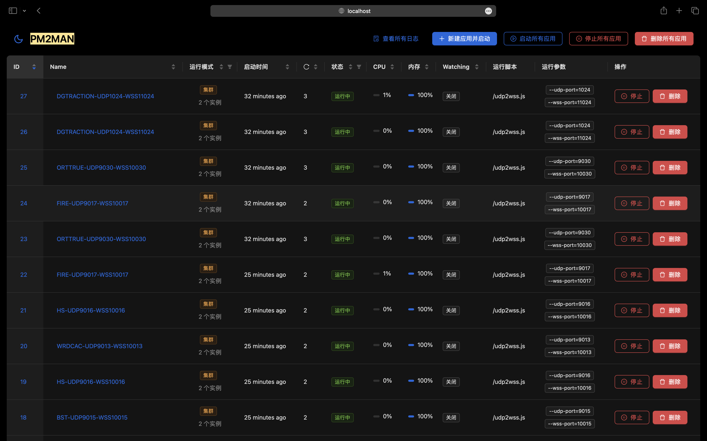

# Documentation

#### PM2MAN

1. Install

```bash
npm install
```

2. Build

```bash
npm run build
```

3. Run

```bash
pm2 serve dist --spa --port 8080 --name pm2man

#### PM2SRV

[PM2SRV](https://github.com/zzwooc/pm2srv)

#### Screenshot

